# Hi, I'm Aly Qamar 👋

  
  
  
  
  

Backend-focused **Software Engineer** specializing in Java Spring Boot. Passionate about building scalable systems, refactoring legacy code, and query optimization.

  

### GitHub Stats

  <picture>
    <source media="(prefers-color-scheme: dark)" srcset="https://github-readme-stats.vercel.app/api?username=alyqamar&theme=tokyonight&show_icons=true&locale=en&hide_border=true" />
    <source media="(prefers-color-scheme: light)" srcset="https://github-readme-stats.vercel.app/api?username=alyqamar&theme=default&show_icons=true&locale=en&hide_border=true" />
    
  </picture>
  &nbsp;&nbsp;
  <picture>
    <source media="(prefers-color-scheme: dark)" srcset="https://github-readme-stats.vercel.app/api/top-langs?username=alyqamar&theme=tokyonight&show_icons=true&locale=en&layout=compact&hide_border=true" />
    <source media="(prefers-color-scheme: light)" srcset="https://github-readme-stats.vercel.app/api/top-langs?username=alyqamar&theme=default&show_icons=true&locale=en&layout=compact&hide_border=true" />
    
  </picture>

